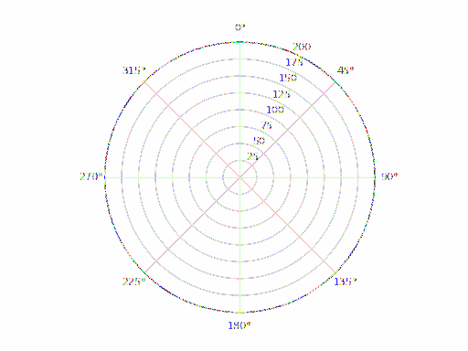

# Arduino Radar Visualization

[](https://github.com/m1tqq/arduino-visualization-radar/actions/workflows/ci.yml)


[](LICENSE)

A real-time radar visualization system built using **Arduino** and **Python**.

An **HC-SR04 ultrasonic sensor** mounted on a servo motor scans a 180° area and sends angle/distance measurements over a serial connection. A Python application processes the incoming data and visualizes the scan in real time using a polar radar-style display.

<p align="center">
  
  <br>
  <em>The visualization in <a href="#simulation">simulation mode</a>, scanning a simulated room. Videos of the real hardware are in <a href="#demonstration">Demonstration</a>.</em>
</p>

> This project was developed as part of a university robotics course.
>
> My contribution focused on the Python side of the system: **serial communication, sensor data processing, simulation, and real-time radar visualization**.

---

## Features

- 180° environment scanning using a servo motor
- Distance measurement using an HC-SR04 ultrasonic sensor
- Arduino-to-Python serial communication, with automatic detection of the Arduino's port
- Real-time polar radar visualization
- Continuous visualization of detected objects
- Simulation mode for testing the visualization without connected hardware

---

## How It Works

The Arduino continuously rotates the ultrasonic sensor between **0° and 180°** and back.

For every angle, it measures the distance to the nearest detected object and sends the measurement over the serial connection in the following format:

```text
angle,distance
```

Example:

```text
90,42
```

The angle is in degrees and the distance in centimetres. A distance of `0` means no echo was received, either because nothing is in range or because the echo was lost.

The Python application reads these measurements, stores the latest distance for each angle, and updates a Matplotlib polar plot in real time. Angles with no echo are left as gaps in the plot. Malformed or partial lines, which can occur right after the serial port is opened, are skipped.

---

## Hardware

- Arduino Uno
- HC-SR04 Ultrasonic Sensor
- Servo Motor
- USB Connection

### Wiring

| Component | Pin     | Arduino |
|-----------|---------|---------|
| HC-SR04   | VCC     | 5V      |
| HC-SR04   | GND     | GND     |
| HC-SR04   | Trig    | D11     |
| HC-SR04   | Echo    | D12     |
| Servo     | Signal  | D9      |
| Servo     | Power   | 5V      |
| Servo     | Ground  | GND     |

A small servo such as the SG90 can be powered from the Arduino's 5V pin. If the servo jitters or the Arduino resets while scanning, power the servo from a separate 5V supply and connect its ground to the Arduino's GND.

---

## Software

- Arduino / C++
- Python 3
- NumPy
- Matplotlib
- PySerial

---

## Project Structure

```text
arduino_radar/
├── arduino_radar/
│   └── arduino_radar.ino    # Arduino sensor and servo control
├── radar.py                 # Shared radar plot and measurement parsing
├── radar_serial.py          # Serial communication and live visualization
└── radar_sim.py             # Visualization simulation without hardware
tests/                       # Unit tests for the Python side
docs/                        # Demo animation for this README
```

---

## Running the Project

### 1. Arduino

Connect the components to the Arduino as shown in [Wiring](#wiring) and upload:

```text
arduino_radar/arduino_radar/arduino_radar.ino
```

The Arduino sends measurements over serial at **9600 baud**.

### 2. Python dependencies

Install the required packages:

```bash
pip install -r requirements.txt
```

### 3. Run the live visualization

With the Arduino connected over USB:

```bash
python arduino_radar/radar_serial.py
```

The script finds the Arduino's serial port automatically. If it picks the wrong one, or none is found, pass the port explicitly:

```bash
python arduino_radar/radar_serial.py --port /dev/tty.usbmodem1201   # macOS
python arduino_radar/radar_serial.py --port /dev/ttyACM0            # Linux
python arduino_radar/radar_serial.py --port COM3                    # Windows
```

The port name is also shown in the Arduino IDE under **Tools → Port**. If the port cannot be opened, the script lists the available ports. Close the Serial Monitor in the Arduino IDE first, since only one program can use the port at a time.

Close the plot window or press `Ctrl+C` to stop.

---

## Simulation

The visualization can also be tested without physical hardware:

```bash
python arduino_radar/radar_sim.py
```

The simulator sweeps from 0° to 180° and back at the same speed as the Arduino, measuring a simulated room with a few objects in it, and plots the results with exactly the same visualization as the live mode.

To plot randomly generated measurements at random angles instead:

```bash
python arduino_radar/radar_sim.py --random
```

---

## Demonstration

### Hardware Setup

[Watch on Google Drive](https://drive.google.com/file/d/1MraulsgjDurmTQOjdV4mJprrjSNbUSZI/view?usp=sharing)

### Demo Video 1

[Watch on Google Drive](https://drive.google.com/file/d/14OXwk00mVM_XMqj0nrh-VkUtTGmzQbUU/view?usp=sharing)

### Demo Video 2

[Watch on Google Drive](https://drive.google.com/file/d/1sofLPVddKBKpiShZTT7O_SAnNK18dq66/view?usp=sharing)

### Demo Video 3

[Watch on Google Drive](https://drive.google.com/file/d/11c58CotUJq63cRjXeROMKPzh5b8_gLaZ/view?usp=sharing)

---

## Testing

The Python side has unit tests for measurement parsing, the radar plot, serial port detection and the simulator:

```bash
pip install pytest
pytest
```

CI runs the tests and compiles the Arduino sketch for the Arduino Uno on every push.

---

## Technologies

`Arduino` · `C++` · `Python` · `NumPy` · `Matplotlib` · `PySerial` · `Serial Communication`

---

## License

[MIT](LICENSE)
